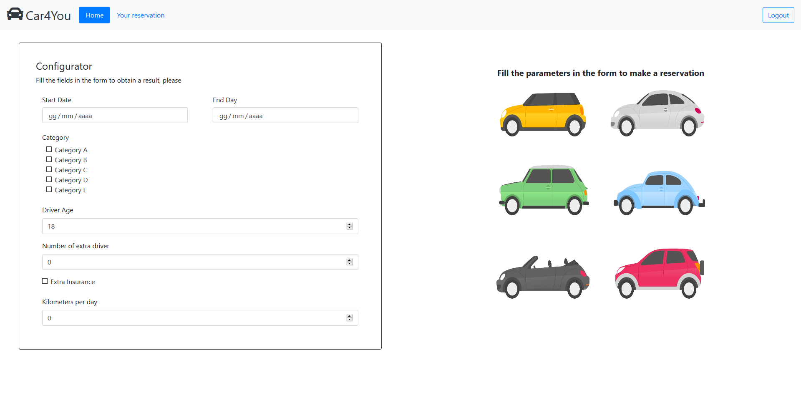
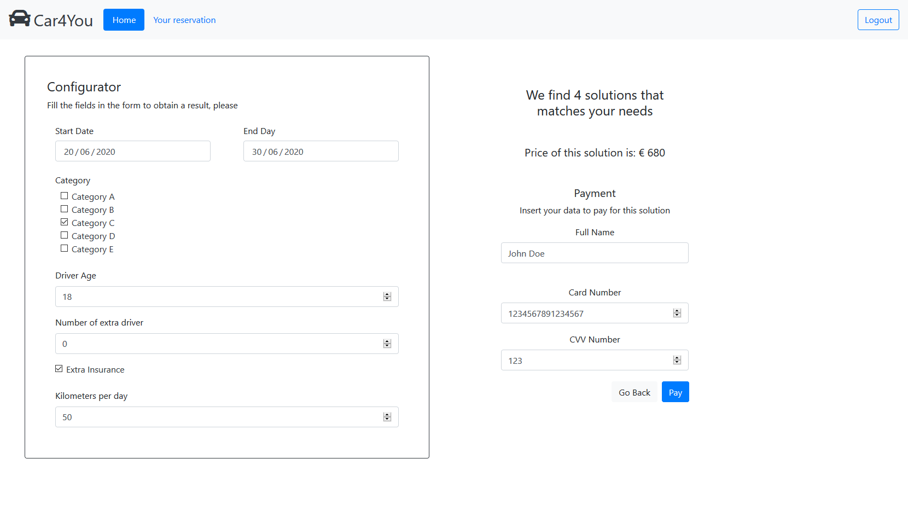

# Exam #1: "Car Rental"

## Student: s279428 LA GALA MARCO

## React client application routes

- Route `/` : public page with the list of all vehicles visible only to unauthenticated users. Unauthenticated users can filter them by category and brand in AND and OR logic. The authenticated user will be redirect to `/vehicle`.

- Route `/login` : public page that allows the unauthenticated user to login. The unauthenticated user can go back to `/` if they no longer wants to login anymore. If the login is successfully completed the user will be redirect to `/book`.

- Route `/book` : (not public) page where the authenticated user can use the "configurator" form and if the proposed solution is satisfactory, they can continue the payment process.

- Route `/reservation` : (not public) page that show all reservations (past and future) made by the user. Future reservations can be canceled.

## REST API server

- POST `/api/login`

  - request body content: email and password
  - response body content: id and name of the user or error object

- POST `/api/logout`
- GET `/api/vehicles`
  - request parameters: empty
  - response body content: Array of objects, each describing a Vehicle, or an error object
- GET `/api/freeCar`
  - request parameters: startDay and endDay of the period in which we want to extract available cars
  - response body content: Array of objects, each describing a Vehicle, or dbErrorObj
- POST `/api/payment`
  - request body content: information to make the payment (FullName, CardNumber, CVV, Price)
  - response body content: message informing the user of the completed payment or an error (error if the Card number or CVV are not exactly between 16 and 3 digits)
- POST `/api/rentals`
  - request body content: information about the rentals (carid, userid, startdate, enddate, driverage, extradriver, km, extrainsurance, price)
  - response body content: errors if something goes wrong
- GET `/api/rentals`
  - request parameters: userId
  - response body content: Array of objects, each describing a Rental, or an error object
- DELETE `/api/rentals/:reservationid`
  - request parameters: reservationid (i.e. id of the reservation that the user wants to cancel)
  - response body content: errors if something goes wrong

## Server database

- Table `users` - contains id (integer), name (text), email (text), password (text). It is used to store the user information and check if the data entered during the login are correct.

- Table `vehicles` - contains id (integer), model(text), brand (text), category (text). It is used to store the information about vehicles available by the company.

- Table `rentals` - contains id (integer), carid (integer), userid (integer), startdate (text), enddate (text), driverage (integer), extradrivers (integer), km (integer), extrainsurance (integer), price (integer). It is used to store the information about the user's reservation.

## Main React Components

- `BrowsingComponent` (in `BrowsingComponent.js`): this component represents the browsing component that contains `LefSidebar` and `MainContent` components. User can see the list of cars and filter them by categories and brands by means checkbox.

  - `LeftSidebar` (in `LeftSidebar.js`): this component represents the left sidebar component. It contains two sections: category and brand. The user can filter the results by clicking on the checkboxes.

  - `MainContent` (in `MainContent.js`): this component represents a container with the list of vehicles inside. According to the filters set in `LeftSidebar` the result changes. If the list is empty the page will show an image to indicate that the search had no results with that combination.

- `LoginComponent` (in `LoginComponent.js`): this component represents the login. Users have a form with _email_ and _password_ to fill in order to log in. The form will show an error message if the email or password is incorrect. Users can click on the _goBack_ button to return to `BrowsingComponent` if they don't want to login anymore.

- `Reservation` (in `Reservation.js`): this component represents the container with the list of reservations. Users can cancel future reservations with a button.

- `InteractiveConfigurator` (in `InteractiveConfigurator.js`): this component represents the 'configurator'. It is made up of two parts: on the left we find the form (`FormComponent`) to fill in the parameters for the new rental while on the right we find the result of the request with a book button (`BookVehicle`).

  - `FormComponent` and `Form` (in `FormComponent.js`): these components represent the form where users can specify the parameter for the request.

  - `BookVehicle` (in `InteractiveConfigurator.js`): this component represents the result of the request made with the form. It shows the number of vehicles available, the price of the solution and a button to book a car with that solution.

    - `PaymentComponent` and `PaymentFormComponent` (in `PaymentComponent.js`): these components allow the user to pay for the proposed solution. It has a form with tree fields. If the fields are correct, the user has booked a machine and is redirected to the booking page (`/book`)

## Screenshot

I uploaded the "configurator" image when the form is empty and when the user accepted the proposal in order to show also the payment form.

## Test users

- id: 1

  - name: Marco
  - email: **marco@gmail.com**
  - password: **marco123**
    _FREQUENT COSTUMER_

- id: 2

  - name: Francesco
  - email: **francesco@gmail.com**
  - password: **francesco123**

- id: 3

  - name: Frequent Customer
  - email: **frequentcustomer@gmail.com**
  - password: **frequentcustomer123**
    _FREQUENT COSTUMER_

- id: 4

  - name: Jhon Doe
  - email: **jhon.doe@gmail.com**
  - password: **jhondoe123**

- id: 5
  - name: Jane Doe
  - email: **jane.doe@gmail.com**
  - password: **janedoe123**

## Extra information

- If you want to book a car with a surplus of 10% due to the "less then 10% vehicles in the same category are left in garage in the days of the rental" you have to book a **category D** car from **2020-07-25 to 20202-07-30**. Inside the console I left some DEBUG print that show the surplus.

- If you want to test the fake API validation, you can pay by entering a card number that is not exactly 16 digits long or a CVV with a different length of 3 digits. It will return an error from the server. For this reason I chose not to validate the number of digits in the client.
